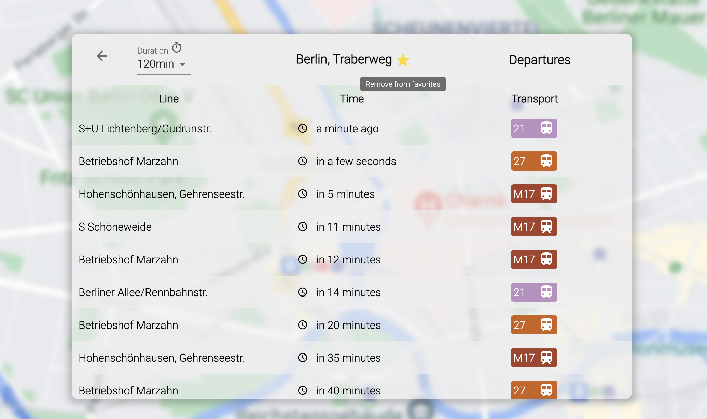

# Ideas

* Should change to TypeScript for type safety.
* Should use eslint prettier for well-formatted code.
* Refactor codebase necessary. Some functions can just written once and move it to under Utils file.
* Also InformationBoard component can be split into smaller components.
* Styling should manage globally (e.g. color codes store only 1 place)
* Redux is complex context API should enough for this project. Because there are no actions that much like in a social app.
* UI testing can be implement with cypress

# berlin-transportation
The Verkehrsverbund Berlin-Brandenburg (VBB) is a transport association run by public transport providers in the German states of Berlin and Brandenburg. This project is a simple React transportation application with VBB data. 

* VBB API [LINK](https://v5.vbb.transport.rest/)
* LIVE DEMO: [VBB Berlin](https://vbb-berlin.herokuapp.com/) - not latest version



# Installation

* Clone the source code & install 

```sh
git clone https://github.com/gokhansisman/berlin-transportation.git
npm install 
npm start
```

# Used

** React.js
** Material-UI
** Redux